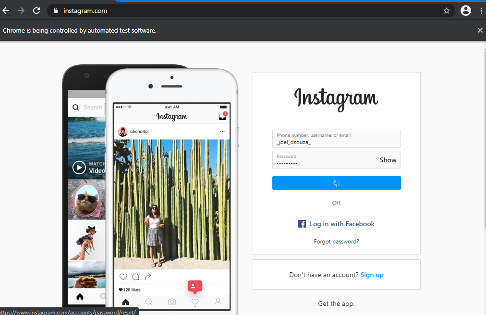
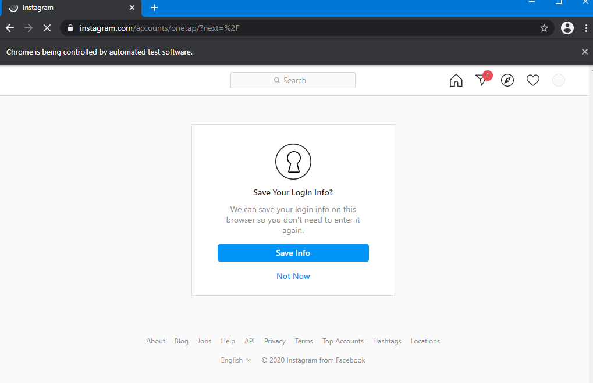
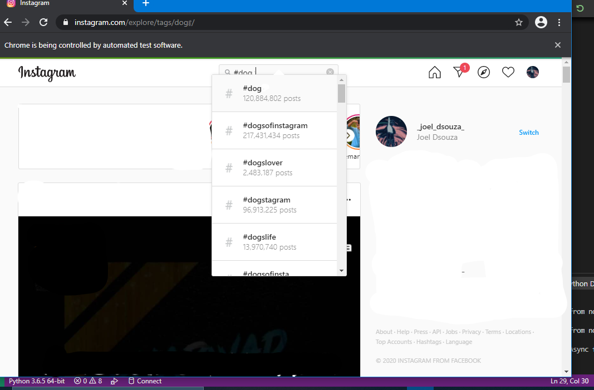
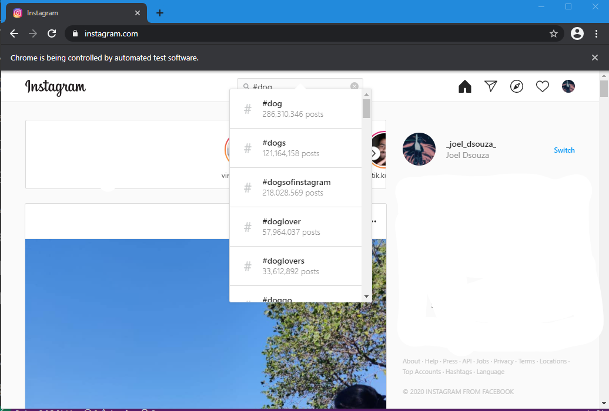
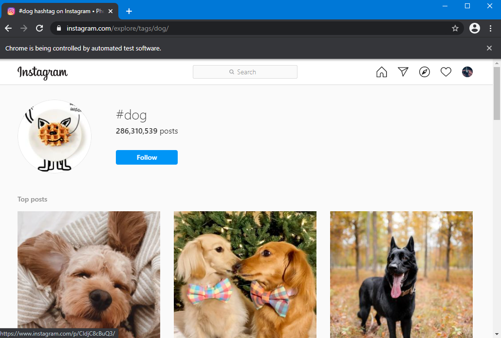
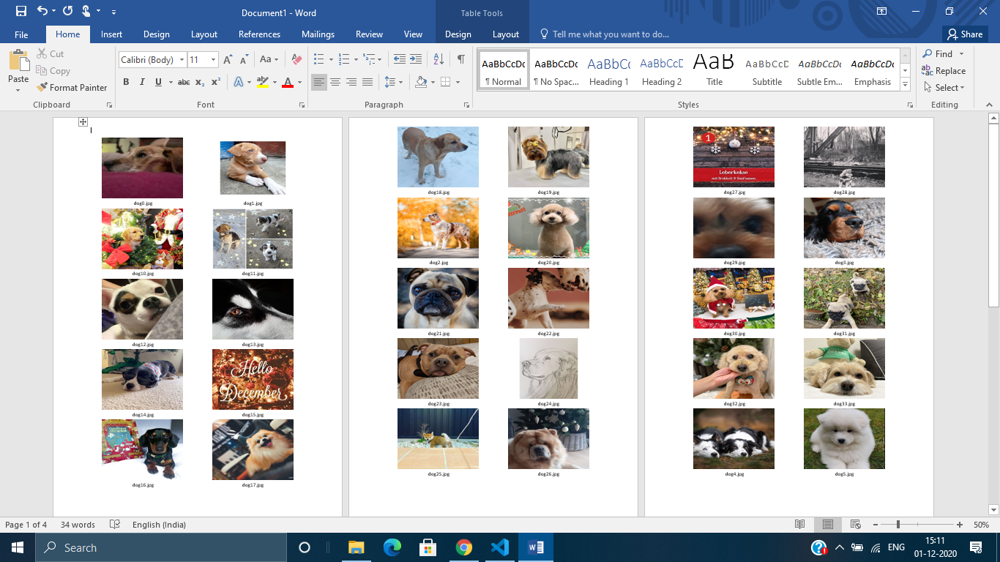
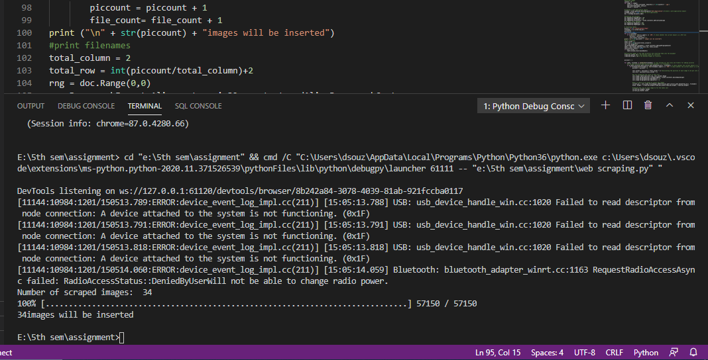

# Web-Scrapping
webscraping (instagram) using selenium and inserting its images into a word document

Developing a python program for fetching photos and downloading the images from any Instagram hashtags or public profiles by web scraping technique and selenium framework 
and generate word document to insert downloaded images.

Make sure Two-Factor-Authentication for your instagram is turned off!

**Screenshots**

 
 
 
 
 
 
 
